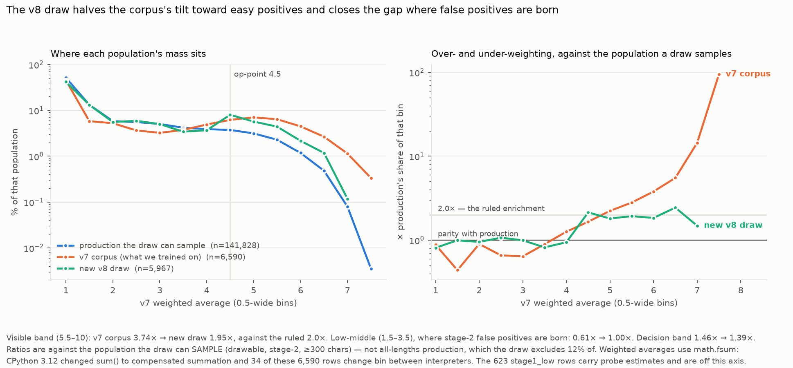

# The v8 training corpus, drawn — and what three review lenses found wrong with the first draw

**2026-08-29. $0 — no oracle calls, no model, no threshold, no probe, nothing deployed.**
The corpus is **drawn and staged, not labelled**: it is a list of articles, and it becomes a
corpus when Phase B scores it. Manifest: [`corpus_manifest.json`](corpus_manifest.json)
(llm-distillery#127).

⛔⛔ **This is the SECOND draw.** Three review lenses — sampling-adversarial, spec-compliance
clause-by-clause, and claim-verification — went over the first one and found **three blockers,
seven warnings and a false control claim**. Every finding is listed in
[§What the review found](#what-the-review-found) rather than quietly fixed, because two of them
are mistakes this project has a named rule against and made anyway.

## What was drawn

| | |
|---|---|
| window | **83 cycle files**, `filtered_20260815_204839` … `filtered_20260829_170332`, enumerated at draw time |
| rows in window | **233,160** → **231,706** distinct articles (4 repeated ids, **1,450 rows whose TEXT already appeared under a different id**) |
| Google News excluded | **54,114** |
| drawable | **177,592** |
| under the 300-char oracle floor, excluded | **20,949** |
| pool sampled | **156,643** |
| **drawn** | **6,590** — matching the v7 corpus, so Phase B's two halves are balanced and disjoint (id overlap with the v7 split: 0) |
| **held-out recall cohort** | **600**, production-mix, **disjoint by construction** |
| staged | `b650-gpu:~/v8_corpus/` — corpus `sha256 5e2cf729…`, cohort `48d740a7…`, plus the pool and manifest, **not in this repo** |

## Did it hit the spec?

| target | rule | realised | |
|---|---|---|---|
| positive base rate | 19.5% | **19.50%** (all rows) / **21.54%** (stage-2 only) | ✅ |
| positive mix | 63.5% marginal | **63.50%** | ✅ |
| non-Latin share | ≥ 9.76% | **9.77%** | ✅ |
| class-A share | ≥ 0.70% | **1.24%** | ✅ |
| **clause (a)** "add no mass above 5.5" | ≤ rate × (1−mix) | **7.12%** vs 7.47% cap | ✅ |
| **clause (c)** "spend the freed budget on 1.5–3.5" | ≥ pool parity | **26.80%** vs 25.45% floor | ✅ |

⚠️ **The enrichment factor is 1.98×, not the ruled 2.0×, and the difference is not rounding.**
The ruled 9.76% baseline is measured on *drawable, stage-2, all lengths*; this draw samples the
*post-300-floor* pool, whose positive rate is **10.90%** because short rows are ~7× less likely
to be positive. Like-for-like the draw is **21.54% / 10.90% = 1.98×**. **A downstream
class-weighting or calibration correction must use the manifest's
`enrichment.realised_factor_vs_sampled_pool`, not the ruled 2.0.**



| band | production the draw can sample | v7 corpus | **new draw** |
|---|---|---|---|
| low-middle 1.5–3.5 *(where stage-2 false positives are born)* | 29.59% | 17.91% = **0.61×** | 29.60% = **1.00×** |
| decision 3.5–5.5 | 14.93% | 21.84% = **1.46×** | 20.76% = **1.39×** |
| visible 5.5–10 | 4.02% | 15.04% = **3.74×** | 7.86% = **1.95×** |

⭐ **The tilt the census diagnosed is halved (3.74× → 1.95×, against a ruled 2.0×) and the
low-middle gap closes to exact parity.** ⚠️ These ratios are against the population the draw can
**sample** — not all-lengths production, which the draw excludes 12% of. The first version of
this document used all-lengths and reported 4.19× → 2.19×, which is the same
target-against-an-excluded-population error the 2026-08-28 Google News correction was written
about, one exclusion later.

## What the review found

### ⛔ BLOCKER — the class-A supplement was drawn from the WRONG SIDE of the op-point
The spec says, verbatim: *"⛔ **Sample the supplement ABOVE the op-point** (ADR-023): that is
where junk reaches readers. Do not hunt the cheap error below it."* The first draw took its
"false positive" arm from harm-title rows scoring **below 3.85** — the 12 rows drawn scored
**1.16–2.08**, i.e. rows the student **already gets right**. As a teaching signal it was inert.

Now: **both arms above the op-point**, 47 rows scoring **4.50–6.93**. ⚠️ And the ruled **3:1
TP:FP cannot be set by a draw**: "harm answered" vs "harm is the dominant subject" is a shape
judgement *within* the above-op population, so the manifest records the balance as
**adjudication-pending** instead of reporting a score proxy that reads like compliance.
⚠️ **Supply is nearly exhausted** — the whole window holds **59** such rows and the draw takes
**47 (80%)**. Above ~8,400 corpus rows the design fails, loudly.

### ⛔ BLOCKER — clause (c) never executed
*"Spend the freed budget on 1.5–3.5"* had no implementation: negatives were allocated strictly
in proportion to the pool, so the realised per-band ratios came out **1.0006 / 1.0000 / 0.9999**
of the pool's — proof the clause did nothing. The band's apparent improvement over v7 was a side
effect of halving the positive enrichment. It is now steered explicitly (`--low-middle-target`,
default parity) and **checked**, and the check is what caught my first steer, which targeted a
share of the negative budget instead of a share of the corpus.

### ⛔ BLOCKER — the FN-check cohort was silently deferred
The corpus **is** the probe's training set, and `train_probe.py` warns that a later cohort *"may
overlap train — a guard, not a clean test"*. Clause (d) wants a production-mix cohort; nothing
produced one, and the omission was not in the "what this does not establish" list. **600 rows
are now reserved at draw time**, at production's positive rate (10.8%, not the corpus's 19.5%),
disjoint by construction and asserted.

### ⛔ My control claim was FALSE — and the cause is more interesting than the claim
The first version said its v7 percentages *"reproduce the census's published table to within one
row per bin (bin-edge convention differs)"*. **They do not**: 6 of 15 bins differ by more than a
row, up to 8. And it is not a convention.

⭐⭐ **CPython 3.12 changed `sum()` to Neumaier compensated summation.** The census ran on Python
**3.11** (naive), this machine runs **3.14** (compensated), and on the *same 6,590 rows with the
same weights* **34 rows land in a different bin**. Example: labels `[6,7,7,6,6,7]` are exactly
**6.5**; naive summation returns **6.49999999999999911**, which bins as 6.0. Verified three ways:
naive reproduces the census's table exactly, `math.fsum` and 3.14's `sum` reproduce this
document's, and running the census's own code on the training host reproduces the census's.
**Neither number is a bug — the histogram was interpreter-dependent.** This file now uses
`math.fsum`, which is correctly rounded and therefore portable.
⚠️ **`docs/evidence/2026-08-28-v8-phase0-drawable-population.md` §6 is affected**: correct as
computed, not reproducible on Python ≥3.12. Its conclusions (the 1.5–3.5 thinness, the visible
band over-weighting) are unchanged in direction and size.
⛔ **I wrote off a real instrument disagreement as a rounding convention and then used the
false agreement as proof of "same instrument".** That is *a failing check may be the control
working*, inverted.

### ⚠️ My non-Latin detector was not the census's — and owner-question 2 is RETRACTED
The first draw used a hand-written script test (**50%** of the first **400** chars) sitting
under a comment claiming it was *"the census's own definition, reused verbatim"*. The census's
is **15% of the first 2000** (`prefilter_removal_probe.script_of`). On the same rows: census
**10.21%**, mine **9.77%**. A dead constant named `NON_LATIN` sat beside it, referenced nowhere.

**Consequence, and it reverses a question I put to the owner.** I asked *"is it OK that the
non-Latin target now enriches rather than matches, since this window is 9.28%?"* — measured with
the wrong ruler. With the census's function the pool is **9.74%** against a 9.76% target: **the
target still matches production, and the question was an artefact of my instrument.**

### ⚠️ The positive class was being reshaped on the axis nobody was watching
Non-Latin rows were allocated proportional to each stratum's *residual quota*, which forces one
flat share into every stratum and **erases the script-by-score association production has**:
pool positive rate is **0.917×** among non-Latin vs Latin; that draw flattened it to **0.994×**.
My first fix (proportional to *supply*) over-corrected to **0.434×** — worse. The rule that works
is holding **P(non-Latin | stratum)** at the pool's value and topping up minimally: realised
**0.899×**, with per-stratum shares tracking the pool to ≤0.4pp except `stage1_low`, which
absorbs the top-up (0.106 → 0.122) and is recorded.

### ⚠️ Design weights now travel with the rows
Inclusion probabilities span **0.033 → 0.857** across the 17 non-empty design cells. A single
scalar "2.0×" cannot carry that. Every drawn row now has `inclusion_probability` and
`design_cell`, and the manifest carries the pool's per-stratum sizes and all 17 cells.

### ⚠️ Known coverage hole: the class-A signal is 0% non-Latin, by construction
`crime_violence` matches **0 of 14,660** non-Latin pool rows. The class-A pool is en 774 / fr 122
/ nl 56 / de 53 / sv 13 / pt 3 / ro 2 / es 1. **So "class-A ≥ 0.70% of the corpus" is a property
of its Latin subset**, measured with the four-language keyword instrument v8 exists to stop
using — and §5b is Latin too, so the no-regression set cannot detect the gap either. Not fixed:
generating non-Latin class-A candidates needs a different route (e5 neighbours of the Latin
seeds). **Stated so it is a known hole rather than an unknown one.**

### Also fixed
- **`domain_of` used `.lstrip("www.")`** — a character *set*, so `washingtonpost.com` became
  `ashingtonpost.com`. 1,897 of 179,042 drawable rows carried a mangled domain. No collisions,
  so the old `distinct_domains` was right by luck, and the Google News exclusion survived only
  because that host starts with neither `w` nor `.`.
- **Id-dedup is not text-dedup.** Ids are source-scoped; **1,450 rows** carried text already
  present under another id. The real risk is a duplicate pair straddling the train/test split
  and inflating the metric the #125 baseline rests on.
- **`stage1_low` scores are on a different SCALE** (0.835–1.000 vs 0–10), so every score-derived
  statistic is now stage-2 only. The old corpus-level class-A ratio swept them all in.
- **The gate was one-sided**: `positive_rate` passed at *≥ 0.9 × target* with no upper bound, so
  a 29% corpus reported PASS against a ruled 19.5%. All ruled levels are now two-sided.
- **Dead code removed** (`take()`, the `NON_LATIN` constant, an unused regex on the pool path).

## Two questions for the owner — ✅ BOTH ANSWERED 2026-08-30

⛔⛔ **CORRECTION, and read it before quoting anything from question 1 below.** This document's
*"the corpus reading is unreachable — 62 of 59"* argument is **RETIRED**. It was derived from this
draw's `realised.class_a_tp_fp = 1.4242…`, a key **misnamed in the manifest this document
describes**: the number is **47/33 — above-op ÷ below-op**, not TP:FP. Under the ruled table a
below-op class-A row is **neither** a TP (harm answered) nor an FP (harm dominant, scoring HIGH)
— it is a harm-lexicon row scoring low, i.e. behaving correctly — so it does not belong in that
denominator. Keeping the ruling's own *"sample ABOVE the op-point"* clause, the corpus's above-op
class-A population **is** the 47-row supplement (the ordinary strata contributed **zero** of their
own), so the two readings select the same rows and there was never a fork.
⚠️ **The manifest committed here still carries the old key** — it is evidence, left as produced.
Later draws emit `class_a_above_below_op` / `corpus_level_above_below_op_ratio`.
Ruling: `docs/decisions/2026-08-30-v8-phase-b-rulings.md` §3.

1. ⚠️ *(As asked on 2026-08-29, superseded by the correction above.)* **Is the 3:1 class-A ratio
   about the supplement or the whole corpus?** The supplement is 47 rows drawn above the
   op-point; TP vs FP needs adjudication. ~~The corpus-level slice cannot reach 3:1 in this window
   under any draw — 75% of the class-A target needs **62** above-op rows and the window holds
   **59**.~~ **Answered: the corpus, which selects the supplement; adjudicate the 47 at labelling
   time.**
2. ✅ **RULED: short-form stays excluded — v8 is trained for long-form only.** ⚠️ **Short-form is excluded** — 20,949 rows (11.8% of drawable) under the 300-char oracle
   floor, which `make_oracle_prefilter` would drop at labelling anyway (#93). **This draw states
   v8 is trained for long-form only.** It is also what makes the enrichment 1.98× rather than
   2.0×. `--short-form include` exists and records what would be lost.

*(A third question — the non-Latin target — is withdrawn above: it was my instrument, not the
window.)*

## How it was made

```bash
# 1. reduce, where the data is — metadata only, NO article text, no torch, no repo
python3 scripts/corpus/draw_v8_corpus.py --archive .../data/filtered/uplifting --reduce pool.jsonl

# 2. draw, where the repo is — the op-point is IMPORTED and the script refuses to run on drift
python3 scripts/corpus/draw_v8_corpus.py --pool pool.jsonl --out corpus_v8 --size 6590 \
        --recall-cohort 600

# 3. materialise, back where the archive is — joins by id AND verifies content_sha256
python3 scripts/corpus/materialise_corpus.py --corpus corpus_v8/corpus.jsonl \
        --archive .../data/filtered/uplifting --out corpus_v8_final.jsonl
```

**6,590 / 6,590 and 600 / 600 materialised, 0 missing, 0 hash-mismatched.** The pool is staged on
b650 beside the corpus, so the draw is re-runnable from staged inputs after the archive rolls.

Tests: `tests/unit/test_draw_v8_corpus.py`, **24 tests**, mutation-tested. The fixture is itself
tested — its harm title must match the production instrument, and its article bodies must be
unique (they were not, which was invisible until text-dedup collapsed the whole synthetic pool).

## What this does NOT establish

- **Nothing here is labelled.** Every figure is stratification on the deployed **v7 student's**
  scores — a sampling variable, not a label.
- **The size (6,590) is not a ruling.** At k=3 the labelling cost is ≈**$10.3** (reordered) /
  ≈**$54.1** (as-is), **measured** — H-V8-8 is answered: the prefix cache survives ≥90 minutes,
  but the "repeat discount" that produced the old ≈$6.9 estimate was an artefact of re-scoring
  identical articles and does not apply to a corpus pass.
- **The 623 `stage1_low` rows** carry e5 probe estimates on a different scale; they are drawn as
  their own stratum for coverage and excluded from every score-derived figure.
- **`stage1_low` is not compositionally identical to stage-2 on this window** (non-Latin 10.6%
  vs 9.4%, class-A 2× lower), so the plan's "composition-neutral" claim is window-specific. The
  coverage argument for including them is unaffected.
