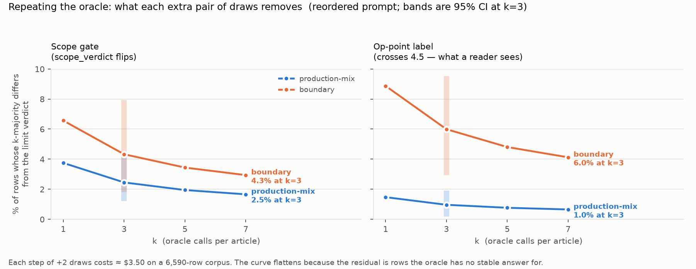
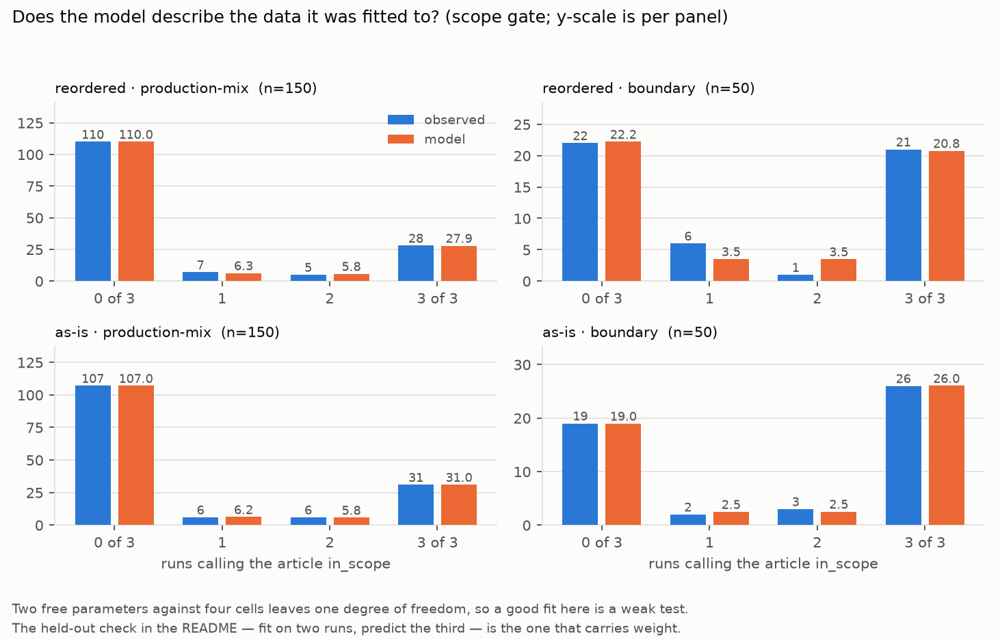

# H-V8-6 — what repeating the oracle buys, and what it costs

**2026-08-29. $0 — no oracle calls.** Re-analysis of the 1,200 Phase A labels
(`docs/evidence/2026-08-29-v8-phase-a-k3/`). No model, no threshold, nothing in `filters/`,
nothing deployed.

⛔⛔ **This is REVISION 2. Revision 1 was reviewed the same day by three lenses and three of
its load-bearing claims did not survive.** They are listed in [§What revision 1 got
wrong](#what-revision-1-got-wrong) rather than deleted, because the errors are more instructive
than the corrections. **The headline verdict also changed**: revision 1 said "k=3 is the
stopping point, k=5 buys 0.5pp for 1.67× the money". In dollars that 1.67× is **+$3.50 on a
6,590-row corpus** — and a $3.50 decision is not one this document should be closing.

## Answer

**Repetition is cheap and buys little, and the "little" is the interesting part.** On the
production mix, going k=1 → k=3 removes gate-label churn on **~86 rows** of 6,590; k=3 → k=5
removes **~33 more** for **+$3.50**; k=5 → k=7 removes ~19 more for another +$3.50. **The money
is not the constraint at this corpus size — so the k decision should be made on whether the
rows are worth having, not on a cost multiplier.**

⭐ **What does not go away with any k:** the residual is dominated by rows whose gate
probability is genuinely near 0.5 — articles the oracle has no stable answer for. That is
#135's *"1/√k cannot touch a Bernoulli"*, now with a price tag on each additional draw.



*The decision in one picture: every curve flattens, and each step right costs the same $3.50.
Bands are the 95% CI at k=3. **The two panels are different questions** — the left is how often
the k-majority **scope verdict** differs from the limit verdict, the right the same thing for
the **op-point label**, which is what a reader actually experiences. ⚠️ This is the residual,
not the flip rate; the distinction is load-bearing throughout this document. Arm A only;
arm B's numbers are in the table below.*

## Two estimands, because the gate and the label are not the same thing

| | what it is | why it matters |
|---|---|---|
| **scope gate** | `scope_verdict == "in_scope"` | flips zero all six dimensions at once (#135) |
| **op-point label** | weighted average ≥ 4.5 | the thing that decides whether a reader sees the article — **and the quantity the plan's ~860-row figure counts** |

⚠️ **The label estimand applies `uplifting v7`'s weights, gatekeeper and 4.5 threshold — imported
live from `filters/uplifting/v7/base_scorer.py` — to scores produced by the v8 prompt.** v8 has
no scorer of its own yet, so this is the only available weighting, but it is cross-version and
the reader should know it.

⚠️ **They move differently, and revision 1 reported only the gate while comparing against a
label figure.** Measured here:

| estimand | arm | stratum | non-unanimous | k=1 | **k=3** | k=5 | k=7 |
|---|---|---|---|---|---|---|---|
| gate | A reordered | R production-mix | 8.0% | 3.75% | **2.45%** | 1.95% | 1.66% |
| gate | A reordered | B boundary | 14.0% | 6.57% | **4.33%** | 3.44% | 2.94% |
| gate | B as-is | R production-mix | 8.0% | 3.73% | **2.43%** | 1.93% | 1.65% |
| gate | B as-is | B boundary | 10.0% | 4.67% | **3.05%** | 2.42% | 2.06% |
| label | A reordered | R production-mix | 3.3% | 1.47% | **0.96%** | 0.77% | 0.65% |
| label | A reordered | B boundary | 18.0% | 8.87% | **5.99%** | 4.81% | 4.12% |
| label | B as-is | R production-mix | 4.0% | 1.90% | **1.24%** | 0.99% | 0.84% |
| label | B as-is | B boundary | 20.0% | 9.12% | **6.14%** | 4.92% | 4.22% |

*(P(the k-majority differs from the verdict an infinitely-repeated oracle would give). k=3 95%
CIs, 400 row-cluster bootstraps refitting inside each replicate: A/R [1.21%, 4.13%], A/B
[1.80%, 7.94%], B/R [1.20%, 3.88%], B/B [0.60%, 5.69%].)*

⭐ **The label is ~2.5× more stable than the gate on the production mix (0.96% vs 2.45%;
arm B 1.24% vs 2.43%, i.e. 2.0×) and LESS stable at the boundary (5.99% vs 4.33%).** Most gate flips happen on rows that were
never near the op-point, so they cost nothing; the flips that matter are concentrated exactly
where the plan said — at the boundary.

### Where the plan's ~860 fits — ⛔ and I got this wrong twice, in opposite directions

The plan writes: *"a k=1 re-score labels ~860 of 6,590 rows by a coin toss, **at the
boundary**"*, and adds that the figure inherits the panel's weighting.

⛔ **Revision 1 compared it to a production-mix gate number.** ⛔ **Revision 2 then called it a
label figure that "reproduces here" — also wrong, and caught by a third review pass.** The
plan's 860 is the **gate**: the same paragraph reads *"the gate flips on 13% of re-runs"*, and
0.13 × 6,590 = **857**. Its own re-measurement note maps that forward to *"5.3% production-mix,
6.7% (as-is) and 9.3% (reordered) at the boundary"* — which are exactly this document's **gate**
pairwise rates.

**So, like for like on the gate:** boundary pairwise flips are 6.67% (as-is) → **~439 rows** and
9.33% (reordered) → **~615 rows**. **The ~860 does not reproduce; it sits above both**, which is
what the probe's own Clopper-Pearson interval [3.8%, 30.7%] on 4/30 already allowed. ⚠️ The
*label* figures at the boundary — 12.0% → ~791 and 13.3% → ~879 — land near 860 and that is a
**coincidence of two different estimands**, not corroboration. Production-mix gate flips are
2.2–2.7%, i.e. **146–176 rows**.

## Cost, in dollars rather than multipliers

Measured per-article prices (Phase A `results.txt` §4f — first pass vs repeat, DeepSeek
off-peak), applied to a 6,590-row corpus:

| arm | k=1 | k=3 | k=5 | k=7 |
|---|---|---|---|---|
| A reordered | $3.42 | **$6.92** | $10.42 | $13.92 |
| B as-is | $18.03 | **$21.65** | $25.28 | $28.90 |

Each extra pair of draws costs **+$3.50 (A) / +$3.62 (B)** and removes **~33 rows** of gate
churn at the production-mix rate.

⚠️⚠️ **The repeat price is unproven at corpus scale — and this is the one branch where the
"money is not the constraint" reading fails.** Phase A §4f prints both: with the repeat
discount, k=3 costs **$6.92 (A) / $21.65 (B)**; **without it, $10.27 (A) / $54.08 (B)**. On the
no-cache branch each extra pair of draws costs **+$3.4 (A) but +$36 (B)**, and for the as-is
prompt k=5 stops being loose change. That branch is exactly what H-V8-8 exists to rule out —
still open, and its own pre-registration was found confounded the same day (see that
directory).

## Checks

- ✅ **A genuine held-out test, replacing revision 1's identity.** Fit the model on **two**
  runs, then predict the **third**, which the likelihood never saw, grouped by what the other
  two said. Pooled over all three rotations:

  | cell | other two said | n | predicted | observed |
  |---|---|---|---|---|
  | A / production-mix | 0/2 | 337 | 1.9% | 2.1% |
  | A / production-mix | 1/2 | 24 | 47.5% | 41.7% |
  | A / production-mix | 2/2 | 89 | 93.6% | 94.4% |
  | B / production-mix | 0/2 | 327 | 1.9% | 1.8% |
  | B / production-mix | 1/2 | 24 | 48.0% | 50.0% |
  | B / production-mix | 2/2 | 99 | 94.2% | 93.9% |
  | B / boundary | 1/2 | 10 | 50.6% | 60.0% |
  | **A / boundary** | **1/2** | **14** | **49.7%** | **14.3%** ⛔ |

  *(8 of the 12 rows `results.txt` prints. The four omitted are all boundary cells that fit
  **well** — A/boundary 0/2 (4.9 vs 8.3) and 2/2 (94.6 vs 98.4), B/boundary 0/2 (4.2 vs 3.4)
  and 2/2 (96.9 vs 96.3) — so the table shown is harder on the model than the full one, but a
  reader could not tell that 2 of 3 A/boundary cells are fine.)*

  ⛔ **One cell misses badly and it is not hidden**: on 14 boundary rows where the other two
  runs split 1-1, the model predicts a coin flip and the held-out run came back `in_scope` only
  twice. n=14, so the binomial interval is enormous — but the model over-predicts churn in
  exactly the ambiguous cell its k=5/k=7 columns are extrapolating from. **Read the boundary
  numbers as the weakest in this document.**
- **Run exchangeability, the model's own assumption, tested per cell** (Cochran's Q). **Six of
  eight cells: p ≥ 0.11. Two mutter, both at the boundary**: arm A *label* — per-run positives
  **[5, 11, 7]**, Q=6.22, **p=0.045**; and arm B *gate* — **[27, 31, 28]**, Q=5.20, **p=0.074**.
  Neither clears 0.05/8 = 0.00625, so neither is significant after multiplicity. They are
  recorded because the whole k>3 extrapolation assumes runs are exchangeable, and the boundary
  stratum is where this document is already weakest. *(An earlier draft of this bullet said
  "seven of eight" and named only the first — the second cell is printed in `results.txt` and
  was dropped from the summary.)*
- **Controls with analytic hand values** (no simulation in the target): point mass at p=0.5 →
  recovered **49.57%** (hand 50.00%); p=0.2 → **10.41%** (10.40%); p=0.05 → **0.72%** (0.73%).
  All three correctly report **ON BOUND**, which is the boundary detector working — a point
  mass needs α→∞, and revision 1 had no such detector.
- **Paired difference between the arms**, on the shared rows (the design is paired — the same
  50 articles under both prompts): production-mix **−0.01%** [−1.44%, +1.51%], boundary
  **+1.57%** [−1.98%, +5.99%]. **NOT DISTINGUISHABLE in either stratum.** Revision 1 claimed
  the reordered arm was less stable at the boundary; **that claim is withdrawn.**
- **`scope_verdict` has five values, not two** — `out_of_scope` 523, `in_scope` 369,
  `harm_is_subject` 259, `response_to_harm` 42, `no_person_benefits` 7. The script asserts the
  vocabulary and prints it, so a future prompt adding a verdict raises instead of silently
  folding into the exclusion class.



*The fit describes its own data in all four cells (χ²(1) p ≥ 0.0599), but with two parameters
against four cells that is a weak test — which is why the held-out table above, not this figure,
is what the conclusion rests on. The one visible strain is the reordered/boundary panel, where
the model splits 3.5/3.5 against an observed 6/1.*

## What revision 1 got wrong

1. ⛔⛔ **Its ⭐ headline validation was an algebraic identity.** Over three draws of a binary,
   discordant pairs are `s(3-s) ∈ {0,2}`, so the pairwise disagreement rate is **exactly**
   (2/3) × non-unanimity; and on the model side `2·E[p(1-p)]` is **exactly** (2/3) × fitted
   non-unanimity. "Predicted 5.21% vs measured 5.3%, four for four" was the *in-sample fit
   residual* rescaled by 2/3 and relabelled as corroboration. **The sibling Phase A README
   already warns that its §1 and §2 are the same statistic**; revision 1 re-imported the
   collapsed pair as a finding. `results.txt` now prints the identity to four decimals so
   nobody derives it a third time.
2. ⛔ **It compared a production-mix *gate* number to a boundary *label* number** and asserted
   the first was a subset of the second ("~83 of those ~860"). Two axes swapped in one
   sentence — the `feedback-sample-carries-its-design-weighting` shape.
3. ⛔ **"1.67× the money" was a draw count, not money.** With the measured repeat discount it
   is 1.51× for arm A and **1.17×** for arm B — and in dollars, **+$3.50**, which does not
   support closing the question.
4. Its 48×48 grid at 1.25× steps was too coarse: one cell's k=3 residual moved 0.25pp on
   refit. Its "resolution ≈1pp" came from a control that landed **exactly on the grid
   ceiling**. Both are gone — this revision uses a bounded optimiser with an edge check and
   exact incomplete-beta moments instead of quadrature (revision 1's midpoint rule integrated
   the Beta(0.039, 0.149) density to **0.42**, not 1.0; it did not matter, and that was luck).

## Reproduce

```bash
python3 docs/evidence/2026-08-29-v8-k3-residual/analyse_k3_residual.py <phaseA-scratch-dir>
python3 docs/evidence/2026-08-29-v8-k3-residual/plot_figures.py     # reads figures_data.json
```

The figures read `figures_data.json`, which the analysis writes — **no number is typed into a
chart by hand.** Palette is the validated categorical default (slots 1–2), checked with the
dataviz validator against the light surface — output committed as
[`palette_validation.txt`](palette_validation.txt): **all five checks pass, worst adjacent CVD
ΔE 24.7, normal-vision ΔE 33.6, both slots ≥ 3:1 contrast.** ⚠️ An earlier draft of this
sentence quoted **ΔE 9.1**, which was the worst pair from a *four*-slot validation run while
choosing colours — not the two-colour palette actually used. Both series are direct-labelled as
well as legended, so identity never rests on colour alone; the surface is deliberately opaque
light so the PNG stays readable under GitHub's dark theme.

⛔⛔ **`<phaseA-scratch-dir>` is NOT in this repo and is NOT durable.** It must hold
`phaseA_cohort200.jsonl` and the six `phaseA_{A,B}{1,2,3}.jsonl` run files — 6.6 MB of full
article text living only in a session scratchpad under `/tmp`, with no other copy on the
machine (whole-filesystem search, 2026-08-29). **Once that tree is cleared, nothing here can be
re-derived.** Where those labels should live is an open owner call.

## Limits

- **Two of the 3,200 bootstrap replicates' fits walked into an optimiser bound** and are
  reported rather than swallowed: 3/400 in gate/as-is/boundary, 4/400 in
  label/reordered/production-mix. Both are in the low single digits, but a bound-hit replicate
  is a different object from a converged one and it widens the interval it lands in.
- **n=200 rows × 3 draws**, 150/50 by stratum. Boundary cells are n=50 and their intervals are
  wide; the held-out check misses in one of them.
- The **k=5 / k=7 columns are extrapolations** of a model fitted on three draws, and they
  assume the draws are exchangeable. Phase A's three runs were minutes apart in one batch.
  ⚠️ **H-V8-8's pre-registration proposes changing that schedule** (three back-to-back calls
  per article rather than three passes) — a different correlation structure from the one these
  numbers were fitted on.
- The estimand is **self-consistency**, not accuracy: the limit verdict is the oracle's own
  central tendency, not ground truth. A row at p=0.5 has no stable answer, and calling the
  limit "right" is a convention.
- Both strata carry the Phase A **design weighting** (boundary ~4.4× oversampled). Applying the
  production-mix rate to 6,590 rows gives k=3 ≈ **162** rows; applying the cohort's own draw
  weights (R 142,373 / B 10,738 → boundary share **7.01%**) gives ≈ **170**. **Neither is a
  production figure**, and the gap between them is the design weighting, not uncertainty.
